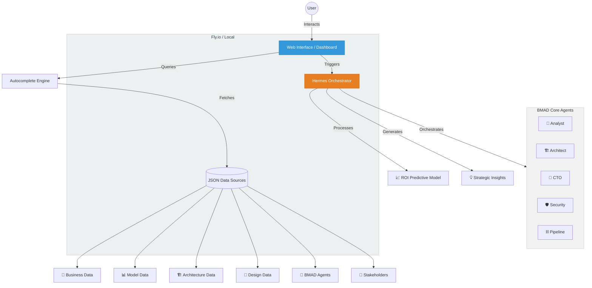

# 🏗️ Paperclip Co. System Architecture

This document outlines the high-level architecture of the **Paperclip Co. Enterprise BMAD Portal**, highlighting the integration between the frontend, the data sources, the **Hermes Orchestrator**, and the underlying infrastructure.

---

## 🎯 Project Context

This is a **BMAD (Business Model Architecture Design) showcase project** 🧷. Paperclip Co. is currently working on creating **data models for other enterprises** 🏢. Their flagship implementation is **Auto Complete by trained models** 🤖✨ — an intelligent autocomplete system powered by enterprise-trained AI agents.

---

## 🌐 Infrastructure & Deployment

The system is designed for high availability and low latency, supporting both cloud and edge environments:

- 🚀 **Cloud (Production)**: Hosted on **Fly.io** 🎈. Leveraging globally distributed Firecracker microVMs for rapid scaling and proximity to users.
- 💻 **Local (Development)**: Fully containerized environment for local execution, ensuring parity between dev and prod.
- 🔒 **Security**: End-to-end TLS and isolated runtime environments for AI agents.

---

## 📊 System Overview Diagram

---

## 🤖 BMAD Core Agent Team

The project utilizes a multi-agent swarm, each with specialized personas:

| Agent | Emoji | Human Name | Role | Color |
|-------|-------|------------|------|-------|
| **Analyst** | 🧠 | Mary | Market research & ROI analysis | `Blue` |
| **Architect** | 🏗️ | Rifat | System design & blueprinting | `Green` |
| **CTO** | 👔 | Chidi | Technical strategy & governance | `Purple` |
| **Security** | 🛡️ | Sarah | Compliance & data protection | `Red` |
| **Orchestrator** | ⚡ | Hermes | Task routing & coordination | `Orange` |
| **Pipeline** | ⛓️ | Alex | CI/CD & automation | `Grey` |
| **Transformation**| 🔄 | Leo | Change management & adoption | `Teal` |
| **Coach** | 🏁 | Sam | Team alignment & methodology | `Gold` |
| **Content** | 📝 | Maya | Knowledge base & documentation | `Brown` |
| **Dashboards** | 📊 | Elena | Visualizations & reporting | `Navy` |

---

## 🧩 Core Components

1. 🖥️ **Frontend (Vanilla JS/CSS)**: Provides a responsive, real-time interface for searching enterprise data and interacting with the Hermes Agent.
2. 📁 **Data Layer (JSON)**: Decentralized data sources following the BMAD method structure.
3. ⚡ **Hermes Orchestrator**: An AI-driven service that coordinates workflows and executes complex business logic like the ROI Model.
4. 🏗️ **Infrastructure**: Managed deployment on **Fly.io** or local environments.

---

> *"Transforming legacy enterprises into agentic AI architectures, one paperclip at a time."* 📎✨
