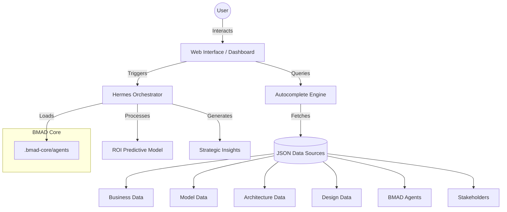

# Paperclip Co. System Architecture

This document outlines the high-level architecture of the Paperclip Co. Enterprise BMAD Portal, highlighting the integration between the frontend, the data sources, and the Hermes Orchestrator.

## System Overview Diagram

## Core Components

1.  **Frontend (Vanilla JS/CSS)**: Provides a responsive, real-time interface for searching enterprise data and interacting with the Hermes Agent.
2.  **Data Layer (JSON)**: Decentralized data sources following the BMAD method structure.
3.  **Hermes Orchestrator**: An AI-driven service (simulated) that coordinates workflows and executes complex business logic like the ROI Model.
4.  **BMAD-METHOD™ Framework**: A set of persona-based agent definitions located in `.bmad-core/agents/`.
